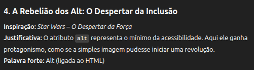
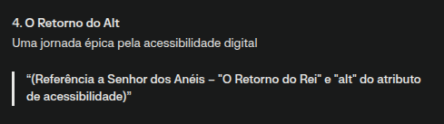
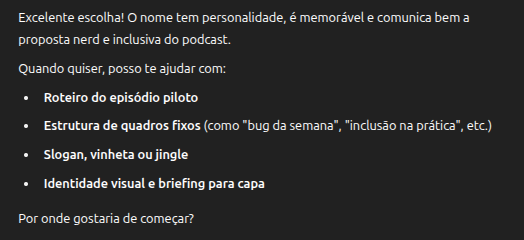
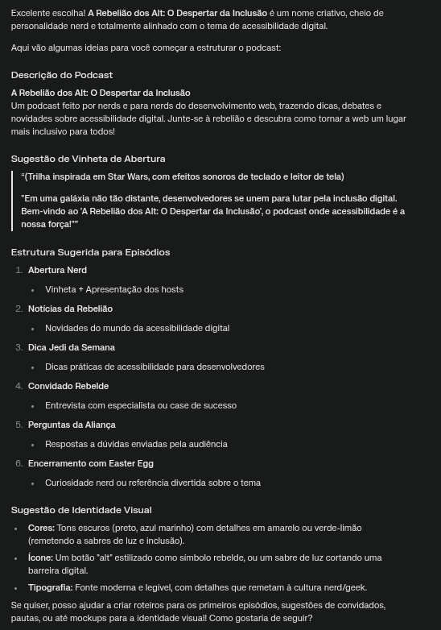
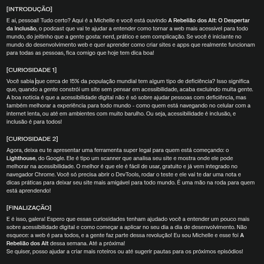
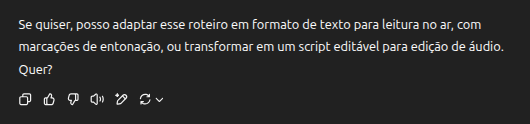
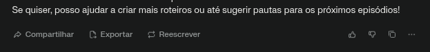

    preview do podcast

# Batalha de IAs
 

## 💻 Tecnologias comparadas na criação de um podcast

- [ChatGPT](https://chat.openai.com/)
- [Perplexity](https://www.perplexity.ai/https://chat.openai.com/)

 

## 🦾 ChatGPT x Perplexity

|        Ação                                           | ChatGPT | Perplexity |
|-------------------------------------------------------|---------|------------|
| Sugestões de nomes                                    |   ✅    |     ✅     |
| Sugestões volutárias após informar o nome escolhido   |         |    ✅ ✅   |
| Conteúdo do roteiro                                   |  ✅ ✅  |            |
| Após o criar o conteúdo do roteiro                    |   ✅    |     ✅     |

 

- Escolha do nome - respostas similares
ChatGPT

Perplexit

- Após informar o nome escolhido - ❤️‍🔥❤️‍🔥❤️‍🔥 Perplexity massacrou o Gepeto com sugestões voluntárias
ChatGPT

Perplexit

- Conteúdo do roteiro - agora o ChatGPT deixou o outro perplexo 😲 com a "personalidade" do texto
ChatGPT

Perplexit

- Após o criar o conteúdo do roteiro - o ChatGPT sugeriu ainda mais personalizações, enquanto o Perplexity já tava focando no próximo episódio
ChatGPT

Perplexit

 

## 👩🏼‍💻 Expert

    
    
&nbsp&nbspMichelle Cordeiro 
    &nbsp
    <a
        href="https://github.com/MichelleCordeiro">
        GitHub
    </a>
    &nbsp;|&nbsp;
    <a
        href="https://www.linkedin.com/in/michelle-cordeiro">
        LinkedIn
    </a>
    &nbsp;|&nbsp;

  

 

  

Made with 💜 by <a href="https://www.linkedin.com/in/michelle-cordeiro/">Michelle Cordeiro</a>

